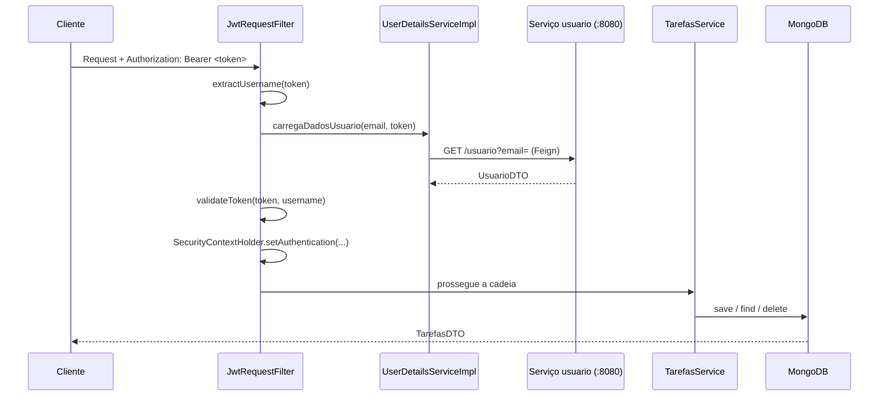

# Agendador de Tarefas — Serviço de Tarefas

Microsserviço REST para agendamento e gerenciamento de tarefas com notificação futura, construído com **Java 17**, **Spring Boot 4** e **MongoDB**.

Este serviço é responsável apenas pelo **domínio de tarefas**. A autenticação e o cadastro de usuários vivem em um serviço separado (`usuario`), consumido aqui via **OpenFeign**. Este serviço não emite tokens — ele apenas **valida** o JWT recebido e resolve o usuário a partir dele.

---

## Stack

| Camada | Tecnologia |
|---|---|
| Linguagem | Java 17 |
| Framework | Spring Boot 4.1.0 (Web MVC) |
| Persistência | Spring Data MongoDB |
| Segurança | Spring Security + JWT (jjwt 0.13) |
| Comunicação entre serviços | Spring Cloud OpenFeign (2025.1.2) |
| Mapeamento DTO ↔ Entity | MapStruct 1.6.3 |
| Boilerplate | Lombok |
| Build | Gradle (wrapper incluso) |
| CI | GitHub Actions (build + testes em cada PR para `master`) |

---

## Arquitetura

O projeto segue uma separação em três camadas, com `business` isolada da infraestrutura:

```
com.javanauta.agendadoratarefas
├── controller/              # Camada de entrada (REST)
│   └── TarefasController
├── business/                # Regras de negócio
│   ├── TarefasService
│   ├── dto/                 # TarefasDTO, UsuarioDTO
│   └── mapper/              # MapStruct: TarefasConverter, TarefasUpdateConverter
└── infrastructure/
    ├── entity/              # TarefasEntity (@Document MongoDB)
    ├── repository/          # TarefasRepository (MongoRepository)
    ├── client/              # UsuarioClient (Feign)
    ├── enums/               # StatusNotificacaoEnum
    ├── exceptions/          # ResourceNotFoundException
    └── security/            # SecurityConfig, JwtUtil, JwtRequestFilter, UserDetailsServiceImpl
```

### Fluxo de uma requisição autenticada



Pontos de projeto relevantes:

- **Sessão `STATELESS`** e **CSRF desabilitado** — apropriado para uma API REST sem estado.
- `anyRequest().authenticated()` — **todos** os endpoints exigem token válido.
- O `emailUsuario` da tarefa **nunca vem do corpo da requisição**: é sempre extraído do `subject` do JWT (`jwtUtil.extrairEmailToken`), evitando que um usuário grave tarefas em nome de outro.
- **MapStruct com dois conversores distintos**: `TarefasConverter` para conversões completas e `TarefasUpdateConverter` com `NullValuePropertyMappingStrategy.IGNORE`, permitindo atualização parcial sem sobrescrever campos com `null`.

---

## Modelo de dados

Coleção MongoDB: **`tarefa`**

| Campo | Tipo | Observação |
|---|---|---|
| `id` | String | `@Id` do MongoDB |
| `nomeTarefa` | String | |
| `descricao` | String | |
| `dataCriacao` | LocalDateTime | Preenchida pelo servidor no momento do cadastro |
| `dataEvento` | LocalDateTime | Data em que a tarefa deve ocorrer / ser notificada |
| `emailUsuario` | String | Extraído do JWT |
| `dataAlteracao` | LocalDateTime | |
| `statusNotificacaoEnum` | Enum | `PENDENTE`, `NOTIFICADO`, `CANCELADO` |

Toda tarefa nasce com status **`PENDENTE`**.

Formato de data nos DTOs: `dd-MM-yyyy HH:mm:ss` (via `@JsonFormat`).

---

## Endpoints

Base: `http://localhost:8081/tarefas`
Todos exigem o header `Authorization: Bearer <token>`.

| Método | Rota | Parâmetros | Descrição |
|---|---|---|---|
| `POST` | `/tarefas` | Body: `TarefasDTO` | Cria uma tarefa. `dataCriacao`, `emailUsuario` e status `PENDENTE` são definidos pelo servidor. |
| `GET` | `/tarefas` | — | Lista as tarefas do usuário dono do token. |
| `GET` | `/tarefas/eventos` | `dataInicial`, `dataFinal` (ISO date-time) | Lista tarefas cuja `dataEvento` está no intervalo. |
| `PUT` | `/tarefas` | `id` (query), Body: `TarefasDTO` | Atualização parcial (campos `null` são ignorados). |
| `PATCH` | `/tarefas` | `id`, `status` (query) | Altera apenas o status de notificação. |
| `DELETE` | `/tarefas` | `id` (query) | Remove a tarefa. |

### Exemplo — criar tarefa

```bash
curl -X POST http://localhost:8081/tarefas \
  -H "Authorization: Bearer eyJhbGciOi..." \
  -H "Content-Type: application/json" \
  -d '{
        "nomeTarefa": "Consulta odontológica",
        "descricao": "Retorno de avaliação",
        "dataEvento": "20-08-2026 14:30:00"
      }'
```

### Exemplo — buscar por período

```bash
curl "http://localhost:8081/tarefas/eventos?dataInicial=2026-08-01T00:00:00&dataFinal=2026-08-31T23:59:59" \
  -H "Authorization: Bearer eyJhbGciOi..."
```

> Atenção: o corpo do DTO usa `dd-MM-yyyy HH:mm:ss`, enquanto os *query params* de `/eventos` usam ISO (`yyyy-MM-ddTHH:mm:ss`), pois são convertidos por `@DateTimeFormat`.

---

## Como executar

### Pré-requisitos
- JDK 17+
- MongoDB rodando em `localhost:27017`
- Serviço `usuario` rodando em `localhost:8080` (necessário para autenticação)

### Subindo o MongoDB com Docker

```bash
docker run -d --name mongo-agendador -p 27017:27017 mongo:7
```

### Rodando a aplicação

```bash
./gradlew bootRun
```

A API sobe em `http://localhost:8081`.

### Configuração (`application.properties`)

```properties
spring.application.name=agendador-tarefas
spring.mongodb.uri=mongodb://localhost:27017/db_agendador
usuario.url=localhost:8080
server.port=8081
```

---

## CI

O workflow `.github/workflows/gradle.yml` roda em todo Pull Request para `master`:
configura o JDK 17 (Temurin), cacheia as dependências do Gradle, executa `./gradlew build` e `./gradlew test`.

---

## Roadmap

- [ ] **Job de notificação agendado** (`@Scheduled`) — varrer tarefas `PENDENTE` com `dataEvento` próxima, disparar a notificação e mover o status para `NOTIFICADO`.
- [ ] Externalizar a `secretKey` do JWT para variável de ambiente.
- [ ] `@RestControllerAdvice` para tratamento global de exceções e respostas de erro padronizadas.
- [ ] Validação de entrada com Bean Validation (`@Valid`, `@NotBlank`, `@Future` em `dataEvento`).
- [ ] Garantir que `PUT`, `PATCH` e `DELETE` só operem sobre tarefas do usuário autenticado.
- [ ] Testes unitários e de integração (Testcontainers para o MongoDB).
- [ ] Documentação da API com OpenAPI/Swagger.

---

## Autor

**Natan** — [@ntncsdata](https://github.com/ntncsdata)
